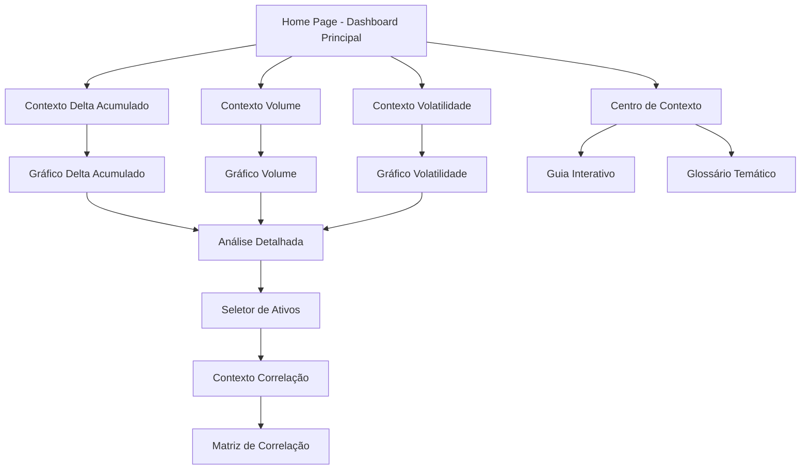

## 1. Product Overview

Dashboard V1 do EDI Market Guardin com tema Stranger Things - uma interface moderna e intuitiva para divulgação de dados financeiros e de mercado. Mantém a seriedade institucional mas com apelo visual que atrai pessoas físicas.

O sistema permite visualização de dados de mercado com elementos visuais inspirados na série, criando uma experiência única e memorável para o usuário. **Versão 1 sem autenticação - dados armazenados localmente em JSON.**

## 2. Core Features

### 2.1 User Roles

Para a V1, não há distinção de usuários - todos os visitantes têm acesso completo aos dados públicos do dashboard.

### 2.2 Feature Module

O EDI Market Guardin V1 consiste nas seguintes páginas principais:

1. **Dashboard Principal**: visualização geral com gráficos temáticos, métricas e elementos visuais Stranger Things
2. **Análise Detalhada**: páginas específicas para cada tipo de dado (ações, criptomoedas, commodities)
3. **Centro de Contexto**: explicações interativas sobre cada indicador antes de mostrar os gráficos

### 2.3 Page Details

| Page Name           | Module Name                   | Feature description                                                                                                            |
| ------------------- | ----------------------------- | ------------------------------------------------------------------------------------------------------------------------------ |
| Dashboard Principal | Hero Section                  | Apresentação visual com logo EDI Market Guardin estilizado, animações de entrada tipo "Upside Down"                            |
| Dashboard Principal | Contexto Delta Acumulado      | Explicação interativa: "Delta Acumulado representa a soma total das variações de preço ao longo do período" seguido do gráfico |
| Dashboard Principal | Gráfico Delta Acumulado       | Visualização com efeitos visuais inspirados em Stranger Things, cores neon e transições suaves (dados de data/delta.json)     |
| Dashboard Principal | Contexto Volume de Negociação | Tooltip educativo: "Volume indica a quantidade de ativos negociados - quanto maior, mais liquidez no mercado"                  |
| Dashboard Principal | Gráfico Volume                | Gráfico de barras animado com estética retrô-futurista, cores vermelho neon e azul elétrico (dados de data/volume.json)        |
| Dashboard Principal | Contexto Volatilidade         | Modal explicativo: "Volatilidade mede o risco - valores altos indicam maior oscilação de preços"                               |
| Dashboard Principal | Gráfico Volatilidade          | Visualização circular estilo radar com efeitos de brilho e partículas (dados de data/volatility.json)                         |
| Análise Detalhada   | Seletor de Ativos             | Interface dropdown com efeito de digitação retrô para escolher ações, criptos ou commodities                                   |
| Análise Detalhada   | Contexto Correlação           | Info card: "Correlação mostra como ativos se movem em relação entre si (+1 = mesmo sentido, -1 = sentido oposto)"              |
| Análise Detalhada   | Matriz de Correlação          | Grid visual interativo com cores que mudam baseado na força da correlação (dados de data/correlation.json)                        |
| Centro de Contexto  | Guia Interativo               | Tutorial gamificado que ensina conceitos financeiros usando metáforas do universo Stranger Things                              |
| Centro de Contexto  | Glossário Temático            | Definições de termos financeiros com ilustrações estilizadas                                                                   |

## 3. Core Process

Fluxo principal do usuário no EDI Market Guardin V1:

O visitante acessa o dashboard e imediatamente vê uma introdução visual com o tema Stranger Things. Cada seção de dados começa com uma explicação contextual em formato interativo (tooltip, modal ou card) que desaparece ao clicar ou após 5 segundos, revelando o gráfico correspondente. **Todos os dados são carregados de arquivos JSON locais na pasta data/ - sem backend.** O usuário pode navegar entre diferentes tipos de análises através de um menu lateral com ícones temáticos.

## 4. User Interface Design

### 4.1 Design Style

* **Cores Primárias**: Vermelho neon (#FF0033), Azul elétrico (#00FFFF), Preto profundo (#0A0A0A)

* **Cores Secundárias**: Roxo místico (#8B00FF), Laranja intenso (#FF4500), Cinza metálico (#2A2A2A)

* **Botões**: Estilo retro-futurista com bordas neon, efeito glow ao hover, tipografia pixelada

* **Fontes**: Título - "Benguiat" (fonte da série), Corpo - "Courier New" para aspecto retro-digital

* **Layout**: Baseado em cards flutuantes com efeitos de profundidade, navegação lateral estilo console antiga

* **Ícones**: Pixel art e estilo synthwave, com animações de pulsação suave

### 4.2 Page Design Overview

| Page Name           | Module Name             | UI Elements                                                                                                  |
| ------------------- | ----------------------- | ------------------------------------------------------------------------------------------------------------ |
| Dashboard Principal | Hero Section            | Logo EDI Market Guardin com efeito de glitch, partículas flutuantes, background com grid 3D estilo Tron      |
| Dashboard Principal | Gráfico Delta Acumulado | Linha de tendência com glow effect, pontos de dados que pulsam como luzes de neon, fundo escuro com estrelas |
| Dashboard Principal | Gráfico Volume          | Barras com gradiente vermelho-rosa, animação de crescimento suave, labels com fonte estilizada               |
| Dashboard Principal | Gráfico Volatilidade    | Radar circular com camadas concêntricas, pontos que se movem como fireflies, efeito aurora boreal            |
| Análise Detalhada   | Seletor de Ativos       | Dropdown com efeito de máquina de escrever, opções que aparecem letra por letra, som de teclado retro        |
| Análise Detalhada   | Matriz de Correlação    | Células que mudam de cor com transição suave, valores que flutuam ao hover, bordas neon                      |
| Centro de Contexto  | Guia Interativo         | Cards deslizantes com personagens temáticos, diálogos estilo mensagem do Demogorgon, progress bar estilo HP  |

### 4.3 Responsiveness

Desktop-first com adaptação mobile. Em dispositivos móveis, os gráficos se reorganizam em coluna única, mantendo a estética mas otimizando para touch. Botões aumentam de tamanho, e a navegação lateral vira um menu hamburger com ícone de lanterna (referência à série).

### 4.4 Animações Especiais

* **Efeito Upside Down**: Transição entre páginas com inversão de cores e distorção

* **Glitch Text**: Títulos que tremem ocasionalmente como interferência de TV

* **Floating Elements**: Cards que flutuam suavemente como se estivessem no ar

* **Neon Pulse**: Bordas dos elementos que pulsam suavemente como luzes de neon

* **Particle System**: Partículas flutuantes no background que respondem ao movimento do mouse