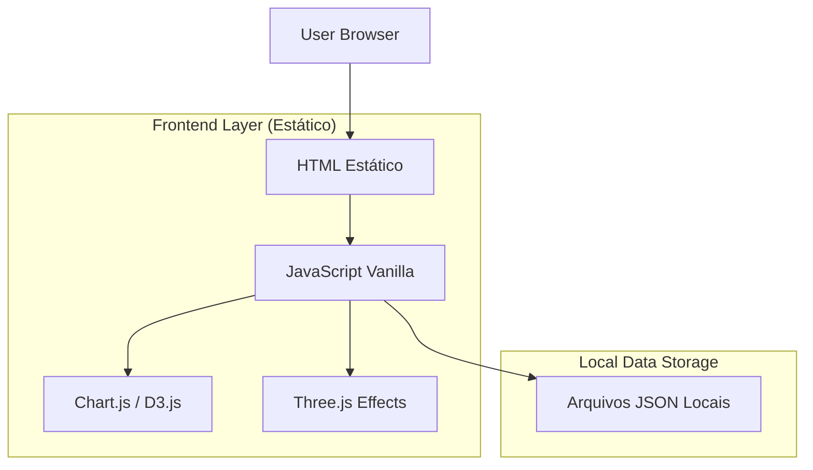

## 1. Architecture design

Para a V1, arquitetura simplificada com HTML estático e dados locais:



## 2. Technology Description

Para a V1 sem backend, optamos por uma solução ultra-simplificada:

* **Frontend**: HTML5 + CSS3 + JavaScript Vanilla (sem frameworks)

* **Charts**: Chart.js\@4 + D3.js\@7 (para visualizações customizadas)

* **3D Effects**: Three.js (para efeitos visuais temáticos)

* **Data Storage**: Arquivos JSON locais na pasta `/data`

* **Build**: Nenhum - HTML estático puro

* **Deployment**: Qualquer servidor web estático (GitHub Pages, Netlify, Vercel)

## 3. Route definitions

Como é HTML estático, as "rotas" são páginas HTML separadas:

| Arquivo HTML           | Propósito                                        |
| ---------------------- | ------------------------------------------------ |
| index.html             | Dashboard Principal com visão geral dos mercados |
| detailed-analysis.html | Análise detalhada com seletor de ativos          |
| context-center.html    | Centro educativo com guias interativos           |

## 4. Local Data Structure

### 4.1 Estrutura de Dados JSON

**Arquivo: data/delta.json**

```json
{
  "metadata": {
    "lastUpdated": "2026-01-12T15:30:00Z",
    "description": "Delta acumulado de preços"
  },
  "data": [
    {
      "timestamp": "2026-01-12T10:00:00Z",
      "value": 1250.75,
      "asset": "IBOV"
    }
  ]
}
```

**Arquivo: data/volume.json**

```json
{
  "metadata": {
    "lastUpdated": "2026-01-12T15:30:00Z",
    "description": "Volume de negociação"
  },
  "data": [
    {
      "asset": "PETR4",
      "volume": 4589200,
      "date": "2026-01-12"
    }
  ]
}
```

**Arquivo: data/volatility.json**

```json
{
  "metadata": {
    "lastUpdated": "2026-01-12T15:30:00Z",
    "description": "Índice de volatilidade"
  },
  "data": [
    {
      "asset": "IBOV",
      "volatility": 0.23,
      "period": "30d"
    }
  ]
}
```

**Arquivo: data/correlation.json**

```json
{
  "metadata": {
    "lastUpdated": "2026-01-12T15:30:00Z",
    "description": "Matriz de correlação entre ativos"
  },
  "assets": ["PETR4", "VALE3", "ITUB4"],
  "matrix": [
    [1.0, 0.8, 0.6],
    [0.8, 1.0, 0.4],
    [0.6, 0.4, 1.0]
  ]
}
```

### 4.2 Funções JavaScript para Carregamento de Dados

```javascript
// utils/dataLoader.js
async function loadJSON(filename) {
  try {
    const response = await fetch(`data/${filename}`);
    return await response.json();
  } catch (error) {
    console.error(`Erro ao carregar ${filename}:`, error);
    return null;
  }
}

// Uso:
const deltaData = await loadJSON('delta.json');
const volumeData = await loadJSON('volume.json');
```

## 5. Estrutura de Arquivos

```
project/
├── index.html                 # Dashboard principal
├── detailed-analysis.html     # Análise detalhada
├── context-center.html       # Centro de contexto
├── css/
│   ├── main.css              # Estilos principais
│   ├── stranger-things.css   # Tema visual
│   └── animations.css        # Animações
├── js/
│   ├── charts.js              # Configurações de gráficos
│   ├── animations.js          # Animações temáticas
│   ├── dataLoader.js          # Carregamento de dados
│   └── ui.js                  # Interações da interface
├── data/                      # Arquivos JSON com dados
│   ├── delta.json
│   ├── volume.json
│   ├── volatility.json
│   └── correlation.json
└── assets/                    # Imagens, fontes, sons
    ├── fonts/
    ├── images/
    └── sounds/
```

## 6. Performance e Otimização

### 6.1 Otimizações para HTML Estático

* **Lazy Loading**: Carregar gráficos apenas quando visíveis

* **Caching**: Usar LocalStorage para dados que não mudam frequentemente

* **Bundle Size**: Manter bibliotecas externas no mínimo necessário

* **CDN**: Servir bibliotecas via CDN para melhor performance

### 6.2 Exemplo de Lazy Loading

```javascript
// Lazy loading de gráficos
function setupChartLazyLoading() {
  const chartElements = document.querySelectorAll('.chart-container');
  
  const observer = new IntersectionObserver((entries) => {
    entries.forEach(entry => {
      if (entry.isIntersecting) {
        loadChart(entry.target);
        observer.unobserve(entry.target);
      }
    });
  });
  
  chartElements.forEach(el => observer.observe(el));
}
```

## 7. Deployment

Como é HTML estático puro, pode ser deployado em qualquer serviço de hospedagem estática:

* **GitHub Pages**: Gratuito e integrado com Git

* **Netlify**: Deploy automático via Git

* **Vercel**: Ótimo para projetos estáticos

* **AWS S3 + CloudFront**: Solução enterprise

* **Servidor Apache/Nginx**: Hospedagem tradicional

### 7.1 Exemplo de Deploy com GitHub Pages

```bash
# Criar branch gh-pages
git checkout --orphan gh-pages

# Adicionar arquivos estáticos
git add .
git commit -m "Deploy V1"

# Push para GitHub Pages
git push origin gh-pages
```

